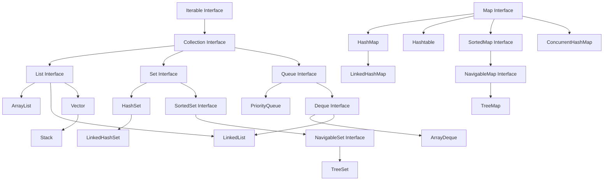

# ☕ Java Collections Framework: Complete Master Guide

A comprehensive, production-grade guide and course covering the **Java Collections Framework (JCF)** from foundational basics to advanced architectural patterns.

---

## 🏛️ 1. Complete Collections Hierarchy



---

## 📊 2. Big-O Complexity Cheat Sheet

| Collection | Underlying Data Structure | Access by Index | Search (Value) | Insertion (Avg) | Deletion (Avg) | Allows Null? | Thread-Safe? |
| :--- | :--- | :--- | :--- | :--- | :--- | :--- | :--- |
| **`ArrayList`** | Dynamic `Object[]` array | $O(1)$ | $O(n)$ | $O(1)$ amortized | $O(n)$ | Yes | No |
| **`LinkedList`** | Doubly-Linked List | $O(n)$ | $O(n)$ | $O(1)$ at head/tail | $O(1)$ at node | Yes | No |
| **`ArrayDeque`** | Circular array buffer | N/A | $O(n)$ | $O(1)$ amortized | $O(1)$ at head/tail | **No** | No |
| **`PriorityQueue`**| Binary Min-Heap | N/A | $O(n)$ | $O(\log n)$ | $O(\log n)$ (poll) | **No** | No |
| **`HashSet`** | `HashMap` backing | N/A | $O(1)$ | $O(1)$ | $O(1)$ | Yes (1 null) | No |
| **`LinkedHashSet`**| `HashMap` + Doubly Linked List| N/A | $O(1)$ | $O(1)$ | $O(1)$ | Yes (1 null) | No |
| **`TreeSet`** | Red-Black Tree | N/A | $O(\log n)$ | $O(\log n)$ | $O(\log n)$ | **No** | No |
| **`HashMap`** | Array of Buckets + TreeNodes | N/A | $O(1)$ key lookup | $O(1)$ | $O(1)$ | Yes | No |
| **`LinkedHashMap`**| Buckets + Doubly Linked List| N/A | $O(1)$ key lookup | $O(1)$ | $O(1)$ | Yes | No |
| **`TreeMap`** | Red-Black Tree | N/A | $O(\log n)$ | $O(\log n)$ | $O(\log n)$ | **No** (keys) | No |
| **`ConcurrentHashMap`**| Node Array + CAS / Synchronized | N/A | $O(1)$ lock-free read | $O(1)$ stripped write | $O(1)$ | **No** | **Yes** |

---

## 🧭 3. Decision Matrix: Which Collection Should I Use?

```mermaid
flowchart TD
    Start{What is your data requirement?}
    
    Start -->|Key-Value Pairs| MapCheck{Need sorted keys or order?}
    MapCheck -->|No ordering needed| HashMap[HashMap]
    MapCheck -->|Preserve insertion/access order| LinkedHashMap[LinkedHashMap / LRUCache]
    MapCheck -->|Sorted keys / Range queries| TreeMap[TreeMap]
    MapCheck -->|Multi-threaded concurrent| ConcurrentHashMap[ConcurrentHashMap]
    
    Start -->|Unique elements only| SetCheck{Need ordering or sorting?}
    SetCheck -->|No ordering needed| HashSet[HashSet]
    SetCheck -->|Preserve insertion order| LinkedHashSet[LinkedHashSet]
    SetCheck -->|Sorted elements| TreeSet[TreeSet]
    
    Start -->|Ordered list / duplicates allowed| ListCheck{Primary usage pattern?}
    ListCheck -->|Fast index read O(1)| ArrayList[ArrayList]
    ListCheck -->|High-frequency inserts at head| LinkedList[LinkedList]
    
    Start -->|LIFO Stack or FIFO Queue| QueueCheck{Priority or Double-Ended?}
    QueueCheck -->|FIFO Queue or LIFO Stack| ArrayDeque[ArrayDeque - Best Practice]
    QueueCheck -->|Priority / Smallest First| PriorityQueue[PriorityQueue]
```

---

## 📚 4. Course Curriculum & Modules

| Module | File | Key Topics Covered |
| :--- | :--- | :--- |
| **01** | [`01_ArrayList_DeepDive.java`](file:///c:/Users/junai/Desktop/coding/java/CollectionFramework/01_ArrayList_DeepDive.java) | Resizing formula ($1.5\times$), CRUD, `Comparable` vs `Comparator`, `ensureCapacity()`, Array conversions |
| **02** | [`02_LinkedList_ListAndDeque.java`](file:///c:/Users/junai/Desktop/coding/java/CollectionFramework/02_LinkedList_ListAndDeque.java) | Node pointer internals, List & Deque double nature, head/tail benchmarks vs `ArrayList` |
| **03** | [`03_Vector_And_Stack.java`](file:///c:/Users/junai/Desktop/coding/java/CollectionFramework/03_Vector_And_Stack.java) | Legacy synchronized Vector, Stack LIFO operations, balanced parentheses algorithm |
| **04** | [`04_HashSet_And_LinkedHashSet.java`](file:///c:/Users/junai/Desktop/coding/java/CollectionFramework/04_HashSet_And_LinkedHashSet.java) | `hashCode()` & `equals()` contract, mathematical set operations (Union, Intersection, Diff), order preservation |
| **05** | [`05_TreeSet_And_NavigableSet.java`](file:///c:/Users/junai/Desktop/coding/java/CollectionFramework/05_TreeSet_And_NavigableSet.java) | Red-Black Tree self-balancing BST, closest matches (`ceiling`, `floor`, `higher`, `lower`), range queries |
| **06** | [`06_PriorityQueue_And_Heap.java`](file:///c:/Users/junai/Desktop/coding/java/CollectionFramework/06_PriorityQueue_And_Heap.java) | Min-Heap / Max-Heap, Emergency Room triage simulation, Top-K largest elements algorithm |
| **07** | [`07_ArrayDeque_Modern_Queue_Stack.java`](file:///c:/Users/junai/Desktop/coding/java/CollectionFramework/07_ArrayDeque_Modern_Queue_Stack.java) | Circular array buffer, modern replacement for `Stack` and `Queue`, sliding window algorithm |
| **08** | [`08_HashMap_Internals_And_Usage.java`](file:///c:/Users/junai/Desktop/coding/java/CollectionFramework/08_HashMap_Internals_And_Usage.java) | Buckets, hash collisions, load factor (0.75), Treeification, `computeIfAbsent`, `merge`, immutable key rules |
| **09** | [`09_LinkedHashMap_And_LRUCache.java`](file:///c:/Users/junai/Desktop/coding/java/CollectionFramework/09_LinkedHashMap_And_LRUCache.java) | Insertion-order vs Access-order modes, implementing a production-grade LRU (Least Recently Used) Cache |
| **10** | [`10_TreeMap_And_NavigableMap.java`](file:///c:/Users/junai/Desktop/coding/java/CollectionFramework/10_TreeMap_And_NavigableMap.java) | Sorted map lookups, tax bracket range query simulation, `subMap`, `headMap`, `tailMap` |
| **11** | [`11_Collections_Utility_Class.java`](file:///c:/Users/junai/Desktop/coding/java/CollectionFramework/11_Collections_Utility_Class.java) | Utility algorithms: `sort`, `binarySearch`, `rotate`, `frequency`, `unmodifiableList`, `synchronizedList` |
| **12** | [`12_Iterators_And_FailFast.java`](file:///c:/Users/junai/Desktop/coding/java/CollectionFramework/12_Iterators_And_FailFast.java) | `Iterator` vs `ListIterator`, `modCount` mechanics, solving `ConcurrentModificationException` |
| **13** | [`13_Concurrent_Collections.java`](file:///c:/Users/junai/Desktop/coding/java/CollectionFramework/13_Concurrent_Collections.java) | `ConcurrentHashMap` lock-striping, `CopyOnWriteArrayList`, `ArrayBlockingQueue` Producer-Consumer |
| **14** | [`14_Streams_With_Collections.java`](file:///c:/Users/junai/Desktop/coding/java/CollectionFramework/14_Streams_With_Collections.java) | Java 8+ Streams: `filter`, `map`, `groupingBy`, `partitioningBy`, `summarizingDouble` |
| **15** | [`15_RealWorld_MiniProject.java`](file:///c:/Users/junai/Desktop/coding/java/CollectionFramework/15_RealWorld_MiniProject.java) | End-to-End E-Commerce & Warehouse Inventory Hub integrating all Collections & Streams |

---

## 🚀 5. How to Compile and Run Any Module

```powershell
# Navigate to the CollectionFramework directory
cd CollectionFramework

# Compile any module (e.g. Module 01)
javac 01_ArrayList_DeepDive.java

# Run the compiled program
java ArrayList_DeepDive
```
