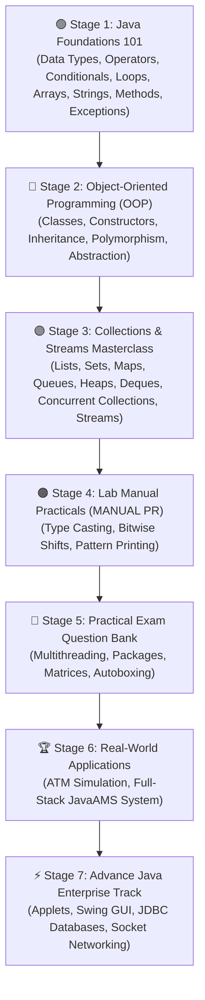

# ☕ Java Programming Mastery: From Foundations to Architecture

[](https://www.oracle.com/java/)
[](https://ken-kanike.github.io/java/)
[](https://github.com/Ken-Kanike/AdvanceJava)
[](LICENSE)

A comprehensive, production-grade, and beautifully structured Java learning repository. Spanning **88 source programs**, this repository covers foundational syntax, deep Object-Oriented Programming (OOP), the complete **Java Collections Framework (JCF)** masterclass, academic practicals, exam solution banks, and production-grade software systems.

🌐 **Interactive Web IDE & Terminal**: Run any code in our live interactive simulated terminal, inspect line-by-line syntax, and explore interactive learning tracks on our [GitHub Pages Portal](https://ken-kanike.github.io/java/).

---

> ### 🚀 Next Step in Learning: [Advance Java Repository](https://github.com/Ken-Kanike/AdvanceJava)
> Ready for Enterprise & GUI Java? Explore our upcoming companion repository covering:
> * 🎨 **Java Swing & AWT**: Desktop GUI Application Development.
> * 🌐 **Java Applets**: Rich web client animations & graphics.
> * 🗄️ **JDBC (Java Database Connectivity)**: MySQL, PostgreSQL, and SQLite integration.
> * 🔌 **Socket Networking**: Client-Server TCP/UDP architecture & chat systems.
> * ⚙️ **Java Servlets & JSP**: Web backends and multi-tier enterprise systems.

---

## 🗺️ Step-by-Step Learning Roadmap



---

## 📑 Table of Contents
1. [1. Java Foundations 101](#1-java-foundations-101)
2. [2. Core Object-Oriented Programming (OOP)](#2-core-object-oriented-programming-oop)
3. [3. Java Collections Framework Masterclass](#3-java-collections-framework-masterclass)
4. [4. Lab Manual Practicals (`MANUAL PR/`)](#4-lab-manual-practicals-manual-pr)
5. [5. Practical Exam Question Bank (`Practical exam/`)](#5-practical-exam-question-bank-practical-exam)
6. [6. Real-World Applications & Systems](#6-real-world-applications--systems)
7. [7. Advance Java Enterprise Track](#7-advance-java-enterprise-track)
8. [8. How to Compile & Run](#8-how-to-compile--run)

---

## 1. Java Foundations 101

Mastering the foundational building blocks of Java: data types, operators, modern switch expressions, loops, array manipulations, string pool internals, methods, and exception handling.

| Program | Topics & Concepts | Key Highlights |
| :--- | :--- | :--- |
| [`01_DataTypes_And_Variables.java`](01_DataTypes_And_Variables.java) | Data Types & Memory | 8 Primitives, ranges, memory sizes in bits, binary/octal/hex literals. |
| [`02_Operators_And_Precedence.java`](02_Operators_And_Precedence.java) | Operators & Precedence | Short-circuit logical (`&&`), bitwise shifts (`<<`, `>>`, `>>>`), ternary operator. |
| [`03_Control_Statements_Conditionals.java`](03_Control_Statements_Conditionals.java) | Decision Making | If-else-if ladders, nested if, modern Java switch with `->` and `yield`. |
| [`04_Loops_And_Iteration.java`](04_Loops_And_Iteration.java) | Loop Control Flow | For, while, do-while, labeled `break` and `continue` across 2D matrices. |
| [`05_Arrays_1D_and_2D.java`](05_Arrays_1D_and_2D.java) | Arrays & Matrices | 1D arrays, 2D rectangular matrices, jagged arrays, `java.util.Arrays` utilities. |
| [`06_Strings_And_StringBuilder.java`](06_Strings_And_StringBuilder.java) | String Internals | String Constant Pool (SCP), immutability, `==` vs `.equals()`, `StringBuilder`. |
| [`07_Methods_And_Recursion.java`](07_Methods_And_Recursion.java) | Methods & Recursion | Strict pass-by-value semantics, varargs (`...`), recursive Factorial & Fibonacci. |
| [`08_Exception_Handling_DeepDive.java`](08_Exception_Handling_DeepDive.java) | Exception Handling | Multi-catch, `finally`, `AutoCloseable` try-with-resources, custom checked exceptions. |
| [`HelloWorld.java`](HelloWorld.java) | Program Structure | `public static void main(String[] args)`, JVM execution model. |
| [`print.java`](print.java) | Output Streams | `print` vs `println`, formatted printing, and escape sequences. |
| [`incr_dcr_opr.java`](incr_dcr_opr.java) | Increment / Decrement | Unary prefix (`++a`) vs postfix (`a++`) evaluations. |
| [`MathFunctions.java`](MathFunctions.java) | Java `Math` Library | `Math.sqrt()`, `pow()`, `abs()`, `ceil()`, `floor()`, `min()`, `max()`. |
| [`Table.java`](Table.java) | Loops & Math | Multiplication table calculation using standard `for` loop. |
| [`ContinueStatement.java`](ContinueStatement.java) | Loop Branching | Skipping loop iterations using the `continue` keyword. |
| [`foreach.java`](foreach.java) | Enhanced For-Loop | Modern array traversal using enhanced `for (Type var : array)` syntax. |
| [`StringBufferExample.java`](StringBufferExample.java) | String Buffers | Mutable buffer methods: `append()`, `insert()`, `replace()`, `delete()`. |
| [`tute14.java`](tute14.java) | Stream Input | User input capture with `BufferedReader` and `InputStreamReader`. |
| [`tute15.java`](tute15.java) | Scanner Input | Multi-type keyboard input parsing with `java.util.Scanner`. |
| [`tute16.java`](tute16.java) | Geometry & Input | Calculating area and perimeter of rectangle with interactive inputs. |
| [`tute18a.java`](tute18a.java) | Simple Conditionals | Maximum of 2 numbers using standard `if-else` blocks. |
| [`tute18b.java`](tute18b.java) | Nested Branching | Maximum of 3 numbers using nested conditional `if-else` hierarchy. |
| [`tute19a.java`](tute19a.java) | Sign Check | Checking whether an entered number is positive or negative. |
| [`tute19b.java`](tute19b.java) | Parity Logic | Validating even vs odd numbers using modulo arithmetic (`n % 2 == 0`). |
| [`tute20.java`](tute20.java) | Menu Branching | Calculator performing Add, Sub, Mul, Div with `switch-case`. |
| [`tute24.java`](tute24.java) | Continuous Menu | Interactive multi-operation calculator looping with `while` and `switch`. |

---

## 2. Core Object-Oriented Programming (OOP)

Encapsulation, inheritance architectures, polymorphism, constructor overloading, abstract classes, static class members, and custom exception handling.

| Program | Core OOP Pillar | Concepts & Implementation |
| :--- | :--- | :--- |
| [`classobj.java`](classobj.java) | **Class & Object** | Class structure, state attributes, behavior methods, and instantiation. |
| [`defaultcons.java`](defaultcons.java) | **Constructors** | Default constructor mechanics and JVM primitive zero-initialization. |
| [`consoverload.java`](consoverload.java) | **Polymorphism** | Constructor overloading with differing arities and parameter types. |
| [`copycons.java`](copycons.java) | **Object Cloning** | Copy constructor pattern for creating deep object clones. |
| [`staticmethod.java`](staticmethod.java) | **Static Members** | Class-level static method execution without object instantiation. |
| [`abstract_class_method.java`](abstract_class_method.java) | **Abstraction** | Abstract base class `Shape`, abstract `area()` contract, and `Rectangle` implementation. |
| [`HierarchicalInheritance.java`](HierarchicalInheritance.java) | **Inheritance** | Hierarchical inheritance: base `Shape` extended by `Circle` and `Rectangle`. |
| [`hybridInheritance.java`](hybridInheritance.java) | **Inheritance & Interfaces** | Hybrid architecture combining class inheritance (`HybridStudent` -> `HybridMarks`) and `HybridSports` interface. |
| [`overload.java`](overload.java) | **Compile-Time Polymorphism** | Method signature overloading with varying parameter counts. |
| [`override.java`](override.java) | **Runtime Dynamic Polymorphism** | Method overriding in derived classes with `@Override` annotation. |
| [`consoverride.java`](consoverride.java) | **Constructor Chaining** | Calling superclass constructors using the `super()` keyword. |
| [`tryp.java`](tryp.java) | **Exception Handling** | Custom user-defined exception `NoMatchException` and `try-catch` validation. |
| [`Vectorpr.java`](Vectorpr.java) | **Generics & Vectors** | Type-safe `Vector<String>` manipulation, capacity growth, and element removal. |

---

## 3. Java Collections Framework Masterclass

Located in the [`CollectionFramework/`](CollectionFramework/) folder. A complete 15-module curriculum from basics to advanced data structures and Java 8+ Streams.

| Module | Program | Key Topics Covered |
| :--- | :--- | :--- |
| **01** | [`01_ArrayList_DeepDive.java`](CollectionFramework/01_ArrayList_DeepDive.java) | Resizing formula ($1.5\times$), CRUD, `Comparable` vs `Comparator`, `ensureCapacity()`, Array conversions |
| **02** | [`02_LinkedList_ListAndDeque.java`](CollectionFramework/02_LinkedList_ListAndDeque.java) | Node pointer internals, List & Deque double nature, head/tail benchmarks vs `ArrayList` |
| **03** | [`03_Vector_And_Stack.java`](CollectionFramework/03_Vector_And_Stack.java) | Legacy synchronized Vector, Stack LIFO operations, balanced parentheses algorithm |
| **04** | [`04_HashSet_And_LinkedHashSet.java`](CollectionFramework/04_HashSet_And_LinkedHashSet.java) | `hashCode()` & `equals()` contract, mathematical set operations (Union, Intersection, Diff), order preservation |
| **05** | [`05_TreeSet_And_NavigableSet.java`](CollectionFramework/05_TreeSet_And_NavigableSet.java) | Red-Black Tree self-balancing BST, closest matches (`ceiling`, `floor`, `higher`, `lower`), range queries |
| **06** | [`06_PriorityQueue_And_Heap.java`](CollectionFramework/06_PriorityQueue_And_Heap.java) | Min-Heap / Max-Heap, Emergency Room triage simulation, Top-K largest elements algorithm |
| **07** | [`07_ArrayDeque_Modern_Queue_Stack.java`](CollectionFramework/07_ArrayDeque_Modern_Queue_Stack.java) | Circular array buffer, modern replacement for `Stack` and `Queue`, sliding window algorithm |
| **08** | [`08_HashMap_Internals_And_Usage.java`](CollectionFramework/08_HashMap_Internals_And_Usage.java) | Buckets, hash collisions, load factor (0.75), Treeification, `computeIfAbsent`, `merge`, immutable key rules |
| **09** | [`09_LinkedHashMap_And_LRUCache.java`](CollectionFramework/09_LinkedHashMap_And_LRUCache.java) | Insertion-order vs Access-order modes, implementing a production-grade LRU (Least Recently Used) Cache |
| **10** | [`10_TreeMap_And_NavigableMap.java`](CollectionFramework/10_TreeMap_And_NavigableMap.java) | Sorted map lookups, tax bracket range query simulation, `subMap`, `headMap`, `tailMap` |
| **11** | [`11_Collections_Utility_Class.java`](CollectionFramework/11_Collections_Utility_Class.java) | Utility algorithms: `sort`, `binarySearch`, `rotate`, `frequency`, `unmodifiableList`, `synchronizedList` |
| **12** | [`12_Iterators_And_FailFast.java`](CollectionFramework/12_Iterators_And_FailFast.java) | `Iterator` vs `ListIterator`, `modCount` mechanics, solving `ConcurrentModificationException` |
| **13** | [`13_Concurrent_Collections.java`](CollectionFramework/13_Concurrent_Collections.java) | `ConcurrentHashMap` lock-striping, `CopyOnWriteArrayList`, `ArrayBlockingQueue` Producer-Consumer |
| **14** | [`14_Streams_With_Collections.java`](CollectionFramework/14_Streams_With_Collections.java) | Java 8+ Streams: `filter`, `map`, `groupingBy`, `partitioningBy`, `summarizingDouble` |
| **15** | [`15_RealWorld_MiniProject.java`](CollectionFramework/15_RealWorld_MiniProject.java) | End-to-End E-Commerce & Warehouse Inventory Hub integrating all Collections & Streams |

👉 **Read the full [Collection Framework Guide & Big-O Complexity Chart](CollectionFramework/README.md)**.

---

## 4. Lab Manual Practicals (`MANUAL PR/`)

Academic lab manual practical experiments covering expressions, bit manipulation, casting, and algorithms.

| Program | Subject Area | Description |
| :--- | :--- | :--- |
| [`MANUAL PR/PGNO10iii.java`](MANUAL%20PR/PGNO10iii.java) | Operator Precedence | Arithmetic expressions and relational evaluations. |
| [`MANUAL PR/pgno17x.java`](MANUAL%20PR/pgno17x.java) | Bitwise Shifts | Left shift (`<<`) and right shift (`>>`) bit manipulation. |
| [`MANUAL PR/pgno26_1.java`](MANUAL%20PR/pgno26_1.java) | Ternary Operator | Conditional operator expressions (`condition ? val1 : val2`). |
| [`MANUAL PR/pgno42_x.java`](MANUAL%20PR/pgno42_x.java) | Type Conversion | Implicit widening and explicit numeric type casting. |
| [`MANUAL PR/pgno441_1.java`](MANUAL%20PR/pgno441_1.java) | Casting Precision | Narrowing conversions from double to integer with precision loss. |
| [`MANUAL PR/pgno48.java`](MANUAL%20PR/pgno48.java) | Class Methods | Class creation and state display methods. |
| [`MANUAL PR/pyramid.java`](MANUAL%20PR/pyramid.java) | Pattern Logic | Star pyramid and numeric pattern printing algorithms. |
| [`MANUAL PR/qb.java`](MANUAL%20PR/qb.java) | Mathematical Algorithms | Number reversal algorithm using iterative while loop. |

---

## 5. Practical Exam Question Bank (`Practical exam/`)

23 examination programs covering core academic curricula (MSBTE / University):

| Program | Exam Topic | Description |
| :--- | :--- | :--- |
| [`Practical exam/PrE_QB1.java`](Practical%20exam/PrE_QB1.java) | Conditionals | Even or odd number validation. |
| [`Practical exam/PrE_QB2.java`](Practical%20exam/PrE_QB2.java) | Character Switch | Vowel vs consonant character evaluation. |
| [`Practical exam/PrE_QB2_ii.java`](Practical%20exam/PrE_QB2_ii.java) | Sign Check | Positive, negative, or zero number verification. |
| [`Practical exam/PrE_QB3.java`](Practical%20exam/PrE_QB3.java) | Loops | Multiplication table generator. |
| [`Practical exam/PrE_QB4_i.java`](Practical%20exam/PrE_QB4_i.java) | Math Series | Sum of natural numbers from 1 to 100. |
| [`Practical exam/PrE_QB4_ii.java`](Practical%20exam/PrE_QB4_ii.java) | Sequences | Iterative number sequence printer (1 to 10). |
| [`Practical exam/PrE_QB5.java`](Practical%20exam/PrE_QB5.java) | Type Casting | Explicit casting between floating point and integer types. |
| [`Practical exam/PrE_QB6.java`](Practical%20exam/PrE_QB6.java) | Constructors | Person record management using constructors. |
| [`Practical exam/PrE_QB7.java`](Practical%20exam/PrE_QB7.java) | String Library | String methods: `length()`, `charAt()`, `substring()`, `toUpperCase()`, `replace()`. |
| [`Practical exam/PrE_QB8.java`](Practical%20exam/PrE_QB8.java) | 2D Arrays | Matrix array input, row/column traversal, and formatting. |
| [`Practical exam/PrEQB9.java`](Practical%20exam/PrEQB9.java) | Vector Class | Vector element insertion, capacity checks, and deletion. |
| [`Practical exam/PrEQB_10.java`](Practical%20exam/PrEQB_10.java) | Wrapper Boxing | Primitive to Wrapper object boxing (`int` -> `Integer`). |
| [`Practical exam/PrEQB_11.java`](Practical%20exam/PrEQB_11.java) | Wrapper Unboxing | Wrapper object to primitive unboxing (`Integer` -> `int`). |
| [`Practical exam/PrEQB_12.java`](Practical%20exam/PrEQB_12.java) | Method Overriding | Runtime method overriding in derived classes. |
| [`Practical exam/PrEQB_13i.java`](Practical%20exam/PrEQB_13i.java) | Single Inheritance | Area and perimeter of rectangle using inheritance. |
| [`Practical exam/PrEQB_13ii.java`](Practical%20exam/PrEQB_13ii.java) | Multilevel Inheritance | Student information and marks average computation. |
| [`Practical exam/PrEQB14.java`](Practical%20exam/PrEQB14.java) | Multiple Inheritance | Implementing multiple inheritance via Java Interfaces. |
| [`Practical exam/PrEQB16.java`](Practical%20exam/PrEQB16.java) | Multithreading | Concurrent thread execution using `Thread` class. |
| [`Practical exam/PrEQB17.java`](Practical%20exam/PrEQB17.java) | Exception Handling | Structured error handling using `try`, `catch`, and `finally`. |
| [`Practical exam/PrEQB_18i.java`](Practical%20exam/PrEQB_18i.java) | Throw & Throws | Explicit exception throwing and method signature declaration. |
| [`Practical exam/MyPackage/Userect.java`](Practical%20exam/MyPackage/Userect.java) | Package Import | User class importing and executing custom package geometry. |
| [`Practical exam/MyPackage/SubFolder/rect.java`](Practical%20exam/MyPackage/SubFolder/rect.java) | Subpackage Design | Nested subpackage geometry encapsulation. |
| [`Practical exam/MyPackage/PrEQB19.java`](Practical%20exam/MyPackage/PrEQB19.java) | Applet Graphics | Java Applet banner rendering with `Graphics.drawString()`. |

---

## 6. Real-World Applications & Systems

### 1. Interactive Console ATM Banking Simulation ([`ATM.java`](ATM.java))
A full console banking system simulation featuring:
- Multi-user authentication with PIN verification.
- Security lockout after 3 consecutive invalid attempts.
- Real-time balance checking, cash deposits, and withdrawal limit validation.

### 2. Full-Stack Java Attendance Management System ([`JavaAMS/`](JavaAMS/))
A lightweight HTTP attendance server with:
- Embedded SQLite database storage (`attendance.db`).
- Dynamic QR code generation with time-expiring UUID session tokens.
- Responsive mobile & desktop HTML5 frontend (`index.html`).

---

## 7. Advance Java Enterprise Track

Continue your journey with the companion repository: **[AdvanceJava](https://github.com/Ken-Kanike/AdvanceJava)**
* 🖼️ **GUI Programming**: Java AWT & Swing component lifecycles, event listeners, and layout managers.
* 🌐 **Java Applets**: Browser client graphic rendering and animations.
* 💾 **JDBC & SQL**: Connection pooling, PreparedStatements, transaction management with databases.
* 📡 **Socket Networking**: Client/Server socket communication, multi-client chat servers.
* 🏢 **Enterprise Architecture**: Java Servlets, Session handling, and MVC patterns.

---

## 8. How to Compile & Run

### Prerequisites
- [JDK 17 or higher](https://www.oracle.com/java/technologies/downloads/) installed.
- Verify installation: `javac -version` and `java -version`.

### Running Core Programs
```bash
# Compile and run any foundational module (e.g. Module 01)
javac 01_DataTypes_And_Variables.java
java DataTypes_And_Variables
```

### Running Collection Framework Modules
```bash
# Navigate to CollectionFramework folder
cd CollectionFramework

# Compile and run any module (e.g. Module 15: Real-World Mini Project)
javac 15_RealWorld_MiniProject.java
java RealWorld_MiniProject
```

### Running Practical Exam Packages
```bash
# Compile package hierarchy
javac "Practical exam/MyPackage/SubFolder/rect.java" "Practical exam/MyPackage/Userect.java"
java -cp "Practical exam" MyPackage.Userect
```

---

## 📄 License & Attribution

This repository is completely open-source and released under the **[MIT License](LICENSE)**. Contributions, suggestions, and stars are warmly welcome!
